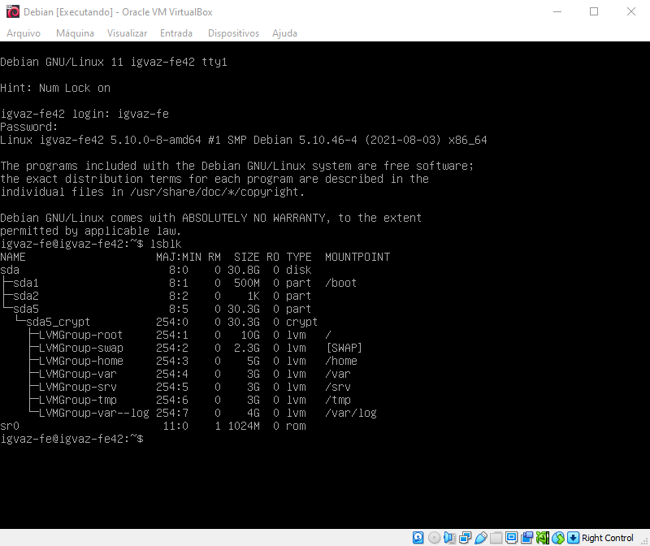

# born2beroot
O Born2beroot é um projeto de um servidor sem interface gráfica em uma máquina virtual. O sistema escolhido foi o Debian, e as screenshots são referentes a instalação do mesmo.

[]

#### More about School 42 you can find here: https://en.wikipedia.org/wiki/42_(school)
